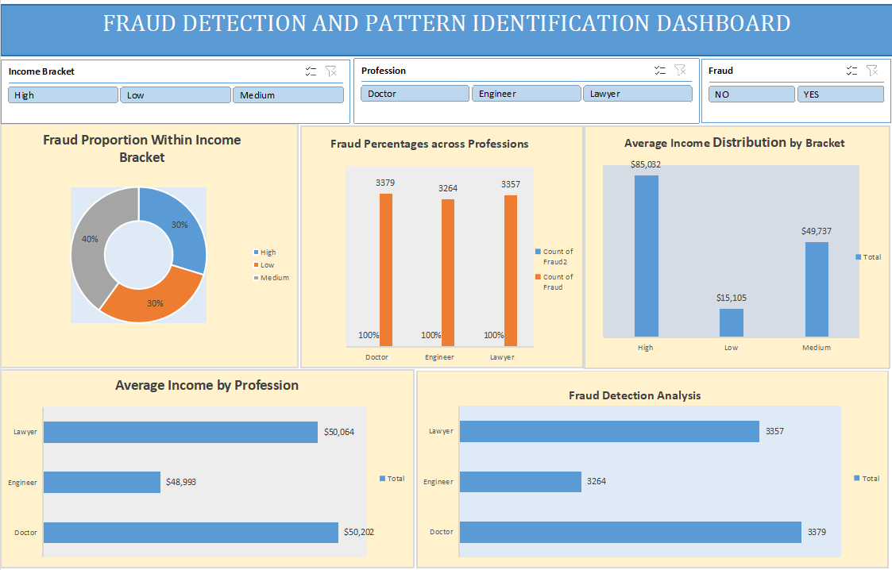

# Fraud-Detection-and-Pattern-Identification-with-Excel
Objectives:

Fraud Detection and Pattern Identification:
Identifying professions, income level and other characteristics that correlate with a higher likelihood of fraud.

Income Influence Analysis:
Exploring the impact of income bracket and specific income levels on fraud rates.
I start by gathering and cleaning the data, followed by creating pivot tables and charts to
visualize the fraud pattern across professsions.

Data from kaggle.com

overview of the Dashboard:

